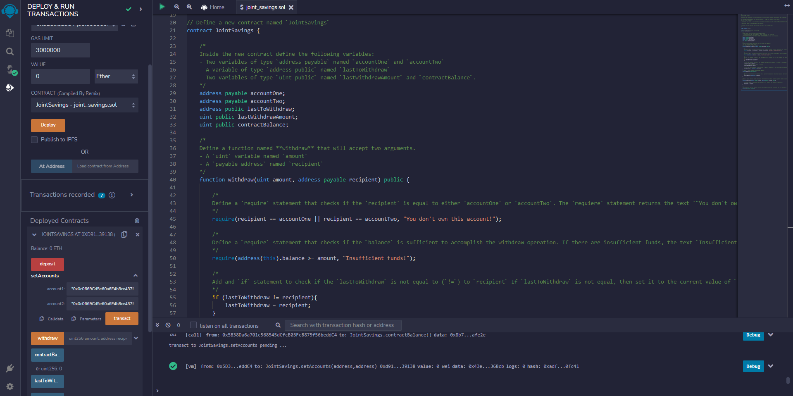
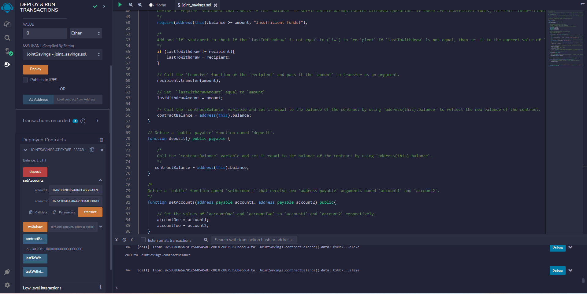
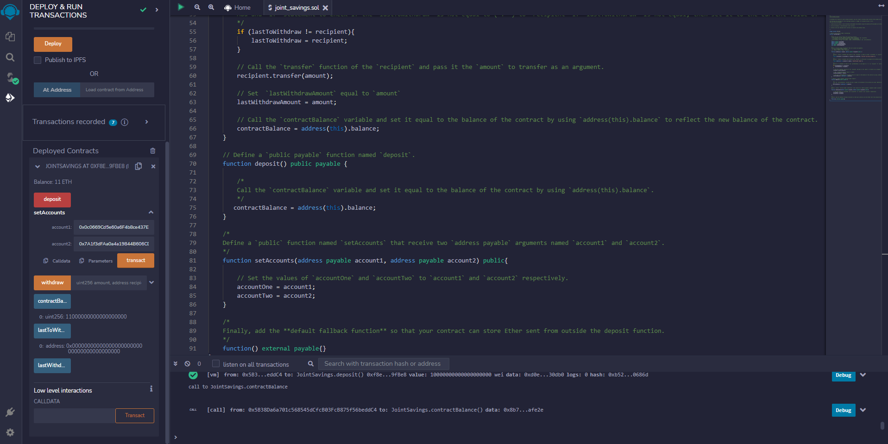
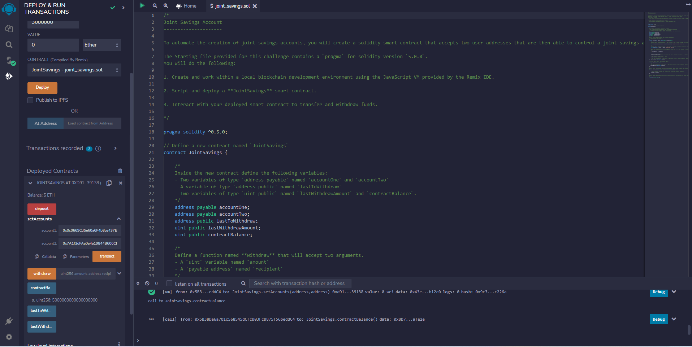
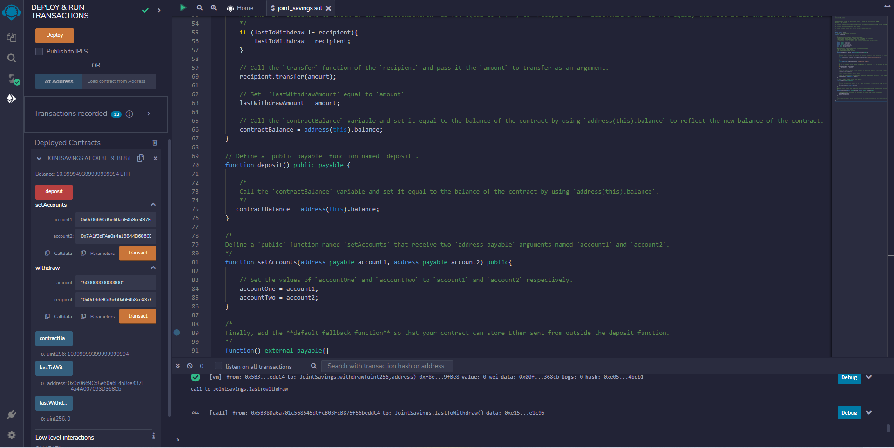

### Smart_Contracts

In order to build a shared savings smart contract on the Ethereum network, we are developing a Solidity smart contract that accepts two user addresses. Our smart contract will fulfill this requirement by leveraging ether management features. These features must be given by a financial institution in order to deposit and withdraw money from these accounts of the shared savings account.

## Technologies
The following package from Python 3.7 is used in this project:

* [Remix IDE](https://remix.ethereum.org)

* [Solidity](https://docs.soliditylang.org/en/v0.8.17/)

## Results Screenshot
### Setting setAccounts function for 2 addresses:

### Send 1 ETH as Wei to joint savings smart contract:

### Send 10 ETH as wei to joint savings smart contract:

### Send 5 ETH to joint savings smart contract:

### Withdraw 5 ETH from joint savings into account one:

### Withdraw 10 ETH from joint savings into account two:

## Contributors
Contributed by Nayana Narayanan.

## License
MIT License
